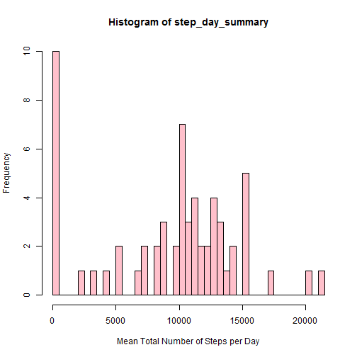
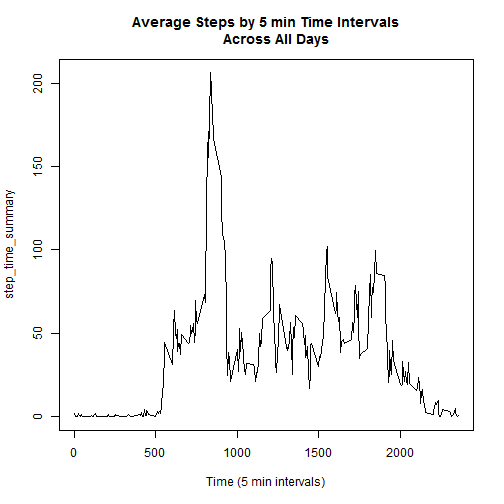
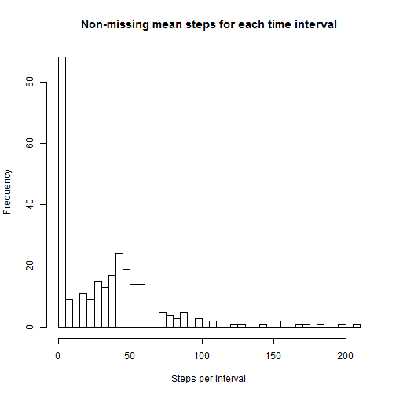
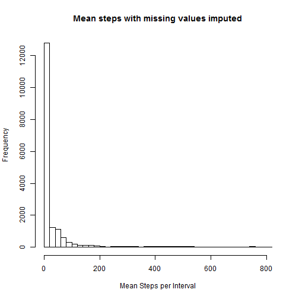
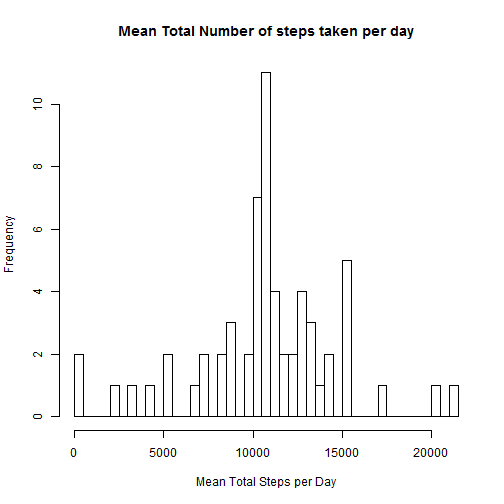
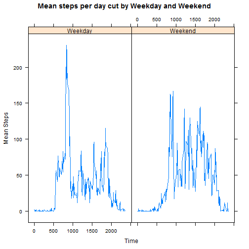

## Step Trends by Day of Week and Time

#### 0) Load the data into R


```r
setwd('C:\\Users\\Nic\\Desktop\\Nic\\Uni Courses\\coursera\\DS Specialisation\\reproducible research\\assign')
dat <- read.csv('activity.csv', header=TRUE)

head(dat)
```

```
##   steps       date interval
## 1    NA 2012-10-01        0
## 2    NA 2012-10-01        5
## 3    NA 2012-10-01       10
## 4    NA 2012-10-01       15
## 5    NA 2012-10-01       20
## 6    NA 2012-10-01       25
```

#### 1) Mean total number of steps taken per day

The histogram of the total number of steps taken per day ignores cases of missing steps. These values are imputed in a section below.


```r
step_day_summary <- tapply(dat$steps, dat$date, sum, na.rm = TRUE)

hist(step_day_summary, breaks = 50, col = "pink",
     xlab = "Mean Total Number of Steps per Day")
```

 


```r
mean_total_daily_steps = as.integer(mean(step_day_summary, na.rm = TRUE)) 
median_total_daily_steps = as.integer(median(step_day_summary, na.rm = TRUE)) 
```

The mean and median number of steps taken per day are:  
* mean: 9354  
* median: 10395  

Which interestingly shows many days where very few steps were taken. This is questionable and may be related to missing valuesfor that particular day.

#### 2) What is the average daily activity pattern?


```r
step_time_summary <- tapply(dat$steps, dat$interval, mean, na.rm=TRUE)

y = as.integer(row.names(step_time_summary)) # this indicates the time in 5 minute intervals

plot(y, step_time_summary, type="l",
     main = "Average Steps by 5 min Time Intervals
     Across All Days", xlab = "Time (5 min intervals)")
```

 

```r
max_steps = data.frame(step_time_summary[step_time_summary == max(step_time_summary)])
```

The maximum average steps in a 5 minute time interval occurs at 835 and is 206.1698113 steps.

#### 3) Imputing missing values


```r
# total number of missing values calc
miss = sum(is.na(dat$steps))
```

The total number of missing values in the dataset is 2304.

These missing values can be imputed by taking the mean of the non-missing 5 minute intervals in place of the missing data.


```r
t <- data.frame(table(dat$interval[is.na(dat$steps)==TRUE]))
head(t) # examine some of the missing data
```

```
##   Var1 Freq
## 1    0    8
## 2    5    8
## 3   10    8
## 4   15    8
## 5   20    8
## 6   25    8
```

As it turns out we have 8 missing values for each time interval.

Here we are calculating a table of times and mean steps for each time interval.


```r
impute_table <- data.frame(tapply(dat$steps, dat$interval, mean, na.rm = TRUE))
impute_table$interval <- row.names(impute_table)
names(impute_table)[1] = "steps_non_missing"
row.names(impute_table) <- NULL
hist(impute_table$steps_non_missing, breaks = 50,
     main = "Non-missing mean steps for each time interval", xlab = "Steps per Interval")
```

 

```r
impute_table$interval <- as.integer(impute_table$interval)
```

Here is the dataset with the missing data imputed


```r
library(plyr)
```

```
## Warning: package 'plyr' was built under R version 3.1.2
```


```r
dat <- join(dat, impute_table, type = "left")
```

```
## Joining by: interval
```

```r
dat$steps <- ifelse(is.na(dat$steps),dat$steps_non_missing, dat$steps)
hist(dat$steps, breaks = 50, main = "Mean steps with missing values imputed", xlab = "Mean Steps per Interval")
```

 

Histogram of total number of steps taken each day with missing values imputed 


```r
step_day_summary <- tapply(dat$steps, dat$date, sum)

hist(step_day_summary, breaks = 50, main = "Mean Total Number of steps taken per day", xlab = "Mean Total Steps per Day")
```

 

```r
mean_imputed = as.integer(mean(step_day_summary))
median_imputed = as.integer(median(step_day_summary))
```

When we impute missing values we have the mean number of total steps taken per day is 10766 and the median number of steps taken per day is 10766  

#### 4) Differences in Activity Pattern Between Weekdays and Weekend


```r
library(lubridate)
```

```
## 
## Attaching package: 'lubridate'
## 
## The following object is masked from 'package:plyr':
## 
##     here
```

```r
library(lattice)
```

We have flagged weekend days and weekdays below.


```r
datey <- ymd(dat$date)
dat$weekday_flag = ifelse(weekdays(datey) %in% c('Saturday','Sunday'), 'Weekend', 'Weekday')
table(dat$weekday_flag)
```

```
## 
## Weekday Weekend 
##   12960    4608
```

So now we can see the 8 days with very few steps have had steps imputed. These days now fall towards the average of the distribution (as we would expect).


```r
datmean <- ddply(dat[,c('weekday_flag', 'interval', 'steps')], .(weekday_flag, interval), summarise,  ms = mean(steps))

xyplot(ms ~ interval | weekday_flag, data = datmean, type = "l", main = "Mean steps per day cut by Weekday and Weekend", xlab = "Time", ylab = "Mean Steps")
```

 

Of a weekday we see trends in activity as people presumably get up and go to work, of a late afternoon and evening we see activity as people return home. During the day people look more sedentary.

Of a weekend people may rise at later times, so we miss the spike in morning activity. Although during the day people appear to be less sedentary.
